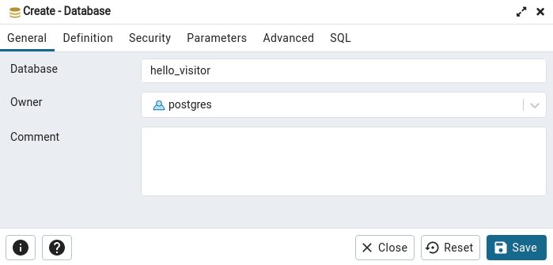

# Hello-Visitor

## Directory

Create & enter a directory for your project:

```bash
mkdir hello-visitor
cd hello-visitor
```


## PostgreSQL

[Install docker-compose](https://docs.docker.com/compose/install/) on your local computer.

Create a file: `hello-visitor/docker-compose.yml`

```yaml
version: "3.9"

services:
  db:
    image: "postgres:13.4"
    env_file: .env
    volumes:
      - hello-visitor-postgres:/var/lib/postgresql/data
    ports:
      - ${POSTGRES_PORT}:5432

volumes:
  hello-visitor-postgres:
```

Create a file: `hello-visitor/.env`

```bash
# the postgres cluster user & password
POSTGRES_USER=postgres
POSTGRES_PASSWORD=<Define-a-password>

# the 'maintenance' database
POSTGRES_DB=postgres

# the port exposed to localhost
POSTGRES_PORT=5432
```

Start the postgresql container:

```bash
docker-compose up -d
```

Connect to the PostgreSQL cluster from [pgAdmin4](https://www.pgadmin.org/docs/pgadmin4/5.3/index.html) , and create a new database with name `hello_visitor`:




## Django Project

### Python environment

Create & activate a python environment, using MiniConda:

```bash
conda create --name hello-visitor python=3.9
conda activate hello-visitor
```

Create a file `hello-visitor/requirements.txt` with this content for the python dependencies:

```bash
django
psycopg2
email-validator
python-dotenv
pydantic
whitenoise
gunicorn
requests
```

Install the python dependencies:

```bash
pip install -r requirements.txt
```


### Directory structure

You will create this directory structure for a Django Project, with 1 Django App and single folder for the HTML templates :

```bash
|-hello-visitor
  |-src
    |- hello_visitor
    |- homepage
    |- templates
```

### Create starter code

- Auto-generate the starter code of `project` and `app_homepage`:

  ```bash
  # from `hello-visitor` directory
  mkdir src
  cd src
  
  # auto-generate starter code for the Django project
  django-admin startproject hello_visitor .
  
  # auto-generate starter code for the Django app
  python manage.py startapp homepage
  
  # create a templates directory
  mkdir templates
  ```

- Add `homepage` to `INSTALLED_APPS`, so it will be included when Django loads the project:

  ```bash
  # file: src/hello_visitor/settings.py
  INSTALLED_APPS = [
      'app_homepage.apps.AppHomepageConfig',
      'django.contrib.admin',
      ...
  ]
  ```

### Configure the database

You need to tell Django how to access the PostgreSQL database that you created earlier. 

You could do this by hard-coding the following in the file `src/hello_visitor/settings.py`:

```python
# DO NOT DO THIS - ILLUSTRATION PURPOSES ONLY

DATABASES = {
    "default": {
        "ENGINE": "django.db.backends.postgresql",
        "NAME": "hello_visitor",
        "USER": "postgres",
        "PASSWORD": "<password>",
        "HOST": "localhost",
        "PORT": "5432",
    }
}
```

However, it is NOT a good practice to hard code a password into your **settings.py**, instead, use pydantic settings management that reads from the `.env` file we created above.

In addition to storing the POSTGRES configuration, lets also move some some other sections from `settings.py` into the `.env` file:

```python
# file: hello-visitor/.env
....
```


Edit the file `src/hello_visitor/settings.py`:

```python
# file: src/hello_visitor/settings.py
...
```


### Create the visit counter Model

The app will count the number of visitors to the homepage and then display it. A simple approach is to create a Model, and then use an ORM data migration to initialize 1 row in the database: 

- Create a `VisitCounter` Model:

  ```python
  # file: src/homepage/models.py
  from django.db import models
  
  
  class VisitCounter(models.Model):
      """ORM for VisitCounter"""
  
      count = models.IntegerField()
  
      @staticmethod
      def insert_visit_counter():
          """Populates database with one visit counter. Call from a data migration."""
          visit_counter = VisitCounter(count=0)
          visit_counter.save()
  
      def __str__(self):
          return f"VisitCounter - number of visits: {self.count}"
  ```

- Do a migration so the database tables are created:

  ```bash
  # in `src` folder
  
  # make sure postgresql container is up & running
  python manage.py makemigrations
  python manage.py migrate
  ```

  Notes: 

  - Verify in pgAdmin4 that you have a new table: `homepage_visitcounter`
  - We did not run any migration yet, so other database tables were created at the same time, for the default apps installed with the starter project.

- Use a `data migration` to create a single row in the `homepage_visitcounter` table.

  - Make an empty migration file you can work from (Django will put the file in the right place, suggest a name, and add dependencies for you):

    ```bash
    # from 'src' directory
    python manage.py makemigrations --empty homepage
    ```

  - Edit the created data migration file, so it calls the `VisitCounter.insert_visit_counter` method that we defined above in the VisitCounter Model:

    ```python
    # file: app_homepage/migrations/0002_auto_-------_----.py
    from django.db import migrations
    from ..models import VisitCounter
    
    
    def insert_default_items(_apps, _schema_editor):
        """Populates database with one visit counter."""
        # To learn about `apps`, see:
        # https://docs.djangoproject.com/en/3.2/topics/migrations/#data-migrations
        VisitCounter.insert_visit_counter()
    
    
    class Migration(migrations.Migration):
        """Runs a data migration"""
    
        dependencies = [
            ("homepage", "0001_initial"),
        ]
    
        operations = [
            migrations.RunPython(insert_default_items),
        ]
    ```

  - Run the data migration:

    ```bash
    # from 'src' directory
    python manage.py migrate homepage

  - Verify in pgAdmin4, that you have one row in the table `homepage_visitcounter`:

    | id   | count |
    | ---- | ----- |
    | 1    | 0     |

### Create the visit counter View, URL & Template

You now have a location in the database to store the visit count. As the next step, define the View, URLConf & Template for app_homepage:

- Create the View for the homepage, which increments the visitor count, saves it in the database, and passes it on to the template for display:

  ```python
  # file: app_homepage/views.py
  from django.shortcuts import render
  
  
  def index(request):
      """View for the main page of the app"""
      visit_counter = get_object_or_404(VisitCounter, pk=1)
  
      # increment the count
      visit_counter.count += 1
      visit_counter.save()
  
      context = {"visit_counter": visit_counter}
      return render(request, "homepage/index.html", context)
  ```

- Create the URLconf for  `homepage`, in a new file `homepage/urls.py`:

  ```bash
  # file: src/homepage/urls.py
  from django.urls import path
  
  from . import views
  
  # The namespace of the apps' URLconf
  app_name = "homepage"
  
  urlpatterns = [
      path("", views.index, name="index"),
  ]
  ```

  Add the URLconf of `homepage` to the URLconf of the project:

  ```bash
  # file: src/hello_visitor/urls.py
  from django.contrib import admin
  from django.urls import include, path
  
  urlpatterns = [
      path('', include('homepage.urls')),
      path('admin/', admin.site.urls),
  ]
  ```

- Create the base HTML template for our project in a new file `src/templates/layouts/base.html`:

  ```html
  <!-- src/templates/layouts/base.html -->
  <!DOCTYPE html>
  
  <html lang="en">
    <head>
      <!-- Required meta tags -->
      <meta charset="utf-8">
      <meta name="viewport" content="width=device-width, initial-scale=1">
  
      <!-- Bootstrap CSS -->
      <link href="https://cdn.jsdelivr.net/npm/bootstrap@5.0.1/dist/css/bootstrap.min.css" rel="stylesheet" integrity="sha384-+0n0xVW2eSR5OomGNYDnhzAbDsOXxcvSN1TPprVMTNDbiYZCxYbOOl7+AMvyTG2x" crossorigin="anonymous">
  
      <title>Hello, visitor!</title>
      <link rel="icon" href="https://frontier-assets.toptal.com/83b2f6e0d02cdb3d951a75bd07ee4058.png"/>
    </head>
    <body>
    
      
  
      <!-- Option 1: Bootstrap Bundle with Popper -->
      <script src="https://cdn.jsdelivr.net/npm/bootstrap@5.0.1/dist/js/bootstrap.bundle.min.js" integrity="sha384-gtEjrD/SeCtmISkJkNUaaKMoLD0//ElJ19smozuHV6z3Iehds+3Ulb9Bn9Plx0x4" crossorigin="anonymous"></script>
  
    </body>
  </html>
  ```

  The base template is the [Bootstrap 5 starter template](https://getbootstrap.com/docs/5.0/getting-started/introduction/#starter-template), which ensures  your pages are set up with the latest *mobile first* design and development standards, including:

  - [HTML5 doctype](https://getbootstrap.com/docs/5.0/getting-started/introduction/#html5-doctype)
  - [responsive viewport meta tag](https://getbootstrap.com/docs/5.0/getting-started/introduction/#responsive-meta-tag). 

- Create the HTML template for the homepage in a new file `src/templates/homepage/index.html`

  ```html
  <!-- src/templates/homepage/index.html -->
  
  
  
    <main>
      <div class="container py-4">
        <div class="p-5 mb-4 bg-dark text-white text-center rounded-3">
          <div class="container-fluid py-5">
            <h1 class="display-5 fw-bold">Hello, visitor {{ visit_counter.count }}!</h1>
          </div>
        </div>
      </div>
    </main>
  
  ```

- Tell Django where to find the templates, by adding a `TEMPLATES['DIRS']` dictionary item:

  ```python
  # file: project/settings.py
  TEMPLATES = [
      {
  		...
          'DIRS': [BASE_DIR / 'templates'],
          ...
      },
  ]
  ```

### Run development server

That should do it. You can now run the project using Django's embedded development web server:

```bash
# in `src` folder
python manage.py runserver
```

When you visit http://127.0.0.1:8000 you will see this, and each time your refresh, the count will go up:

